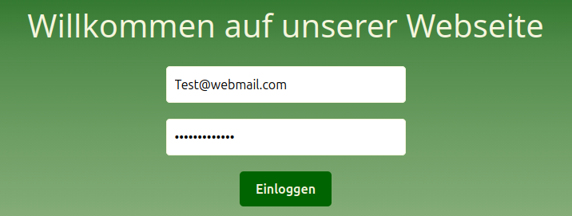
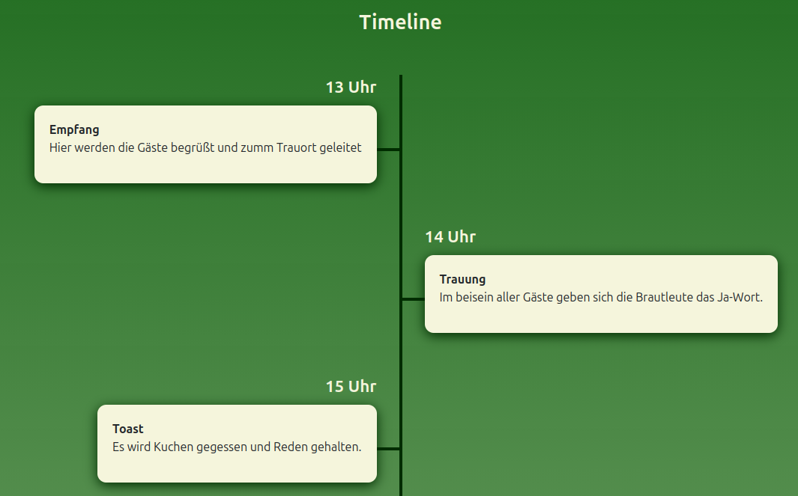
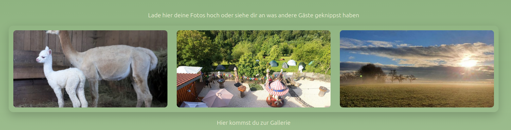
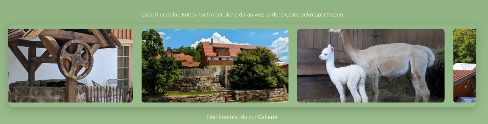
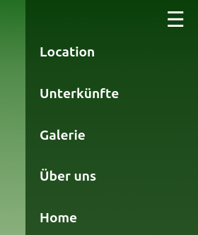
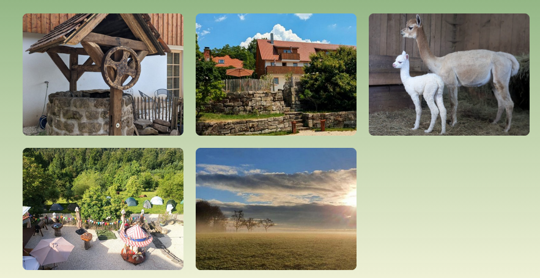
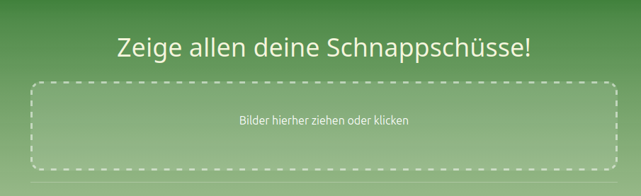
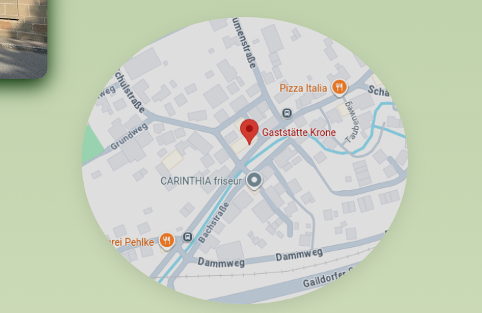

# Web-App Wedding-Page-Projekt (Angular & Firebase)
Status: In Construction 🚧

Dies ist ein Web-Frontend für eine Hochzeits-Manage Webseite, gebaut mit **Angular**. Es bietet eine geschützte Admin-Oberfläche mit verschiedenen interaktiven Modulen.

## Features & Modules

### Authentifizierung (Firebase)
Der Zugang zur App ist durch **Firebase Auth** geschützt. 
* Nur autorisierte Nutzer können die auf die Webseite zugreifen.
* Login erfolgt sicher über E-Mail und Passwort.
* Die Session-Verwaltung wird komplett von Firebase übernommen.

### Timeline
Die zentrale Übersicht des Tages.
* Zeigt aktuelle Ereignisse oder die Planung in chronologischer Reihenfolge.
* Man kann je nach Änderung vorher, die Timeline Dynamisch anpassen.

### Bild-Karussell
Ein interaktiver Slider im Home-Bereich.
* Präsentiert die Highlights des Hotels und der Fotos die bisher von Gästen hochgeladen wurden in einer automatischen Slideshow (alle 5 sec ein neues Bild).
* Optimiert für verschiedene Bildschirmgrößen.

### Sidebar
Die intuitive Navigation der App.
* Schneller Zugriff auf alle Unterseiten (Location, Galerie, Unterkünfte, Über uns, etc).
* Responsives Design, das sich auf mobilen Geräten einklappt und auch im Browser über die drei Striche geöffnet und geschlossen werden kann.

### Galerie mit Drag-and-Drop
Das Herzstück für die Fotoverwaltung.
* **Galerie:** Eine übersichtliche Grid-Ansicht aller hochgeladenen Bilder.

* **Drag-and-Drop Feld:** Ein spezieller Bereich, in dem neue Bilder einfach per "Drag and Drop" oder auch durch klicken in das Feld hochgeladen werden können. Dies sorgt für eine besonders einfache Bedienung beim Verwalten der Gäste-Fotos.

### Maps Anbindung
Die Anbindung von Google Maps für alle wichtigen Standorte.
* Schneller Zugriff auf die Adressen durch ein klick auf das Bild.
* Das Bild zeigtauf der Webseite die genau Location.

